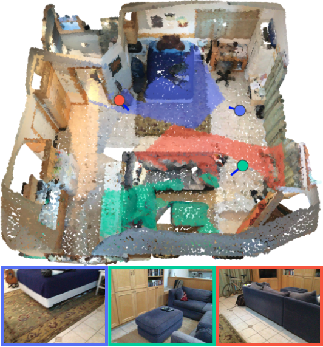
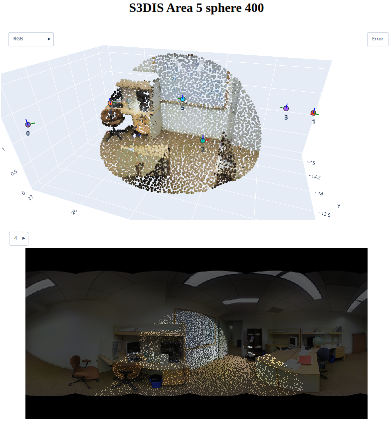

<div align="center">

# DeepViewAgg

[](https://www.python.org/downloads/release/python-379/)
[](https://pytorch.org/get-started/locally/)
[](https://github.com/drprojects/DeepViewAgg/blob/release/LICENSE.md)

Official implementation for
<br>
<br>
[_Learning Multi-View Aggregation In the Wild for Large-Scale 3D Semantic Segmentation_](https://arxiv.org/abs/2204.07548)
<br>
([CVPR'22 Best Paper Finalist 🎉](https://twitter.com/CVPR/status/1539772091112857600))
<br>
[](https://arxiv.org/abs/2204.07548)
[](https://drprojects.github.io/deepviewagg)
[](https://www.youtube.com/watch?v=SoMKwI863tw)
[](https://drive.google.com/file/d/1vtOLLM4VNV5x57HT-60PbeR9QRiOfX7_/view?usp=sharing)
[](https://www.rsipvision.com/ComputerVisionNews-2022July/24)
<br>
<br>
**If you ❤️ or simply use this project, don't forget to give the repository a ⭐,
it means a lot to us !**
<br>
</div>

```
@article{robert2022dva,
  title={Learning Multi-View Aggregation In the Wild for Large-Scale 3D Semantic Segmentation},
  author={Robert, Damien and Vallet, Bruno and Landrieu, Loic},
  journal={Proceedings of the IEEE/CVF Conference on Computer Vision and Pattern Recognition},
  year={2022}
}
```

<br>

## 📌  Description

<p align="center">
  
</p>

We propose to exploit the synergy between **images** 🖼️ and **3D point clouds** 
☁️ by learning to select the most relevant views for each point. Our approach 
uses the **viewing conditions** 👀 of 3D points to merge features from images 
taken at **arbitrary positions**. We reach SOTA results for S3DIS (74.7 mIoU 
6-Fold) and on KITTI- 360 (58.3 mIoU) without requiring point colorization, 
meshing, or the use of depth cameras: our full pipeline **only requires raw, 
large-scale 3D point clouds and a set of images and poses**.

<div align="center">

|                               ✨ DeepViewAgg in short ✨                               |
|:------------------------------------------------------------------------------------:|
|                       🤖 Learns **2D+3D features** end-to-end                        |
|              👀 **Attentive multi-view aggregation** from **viewing conditions**     |
| 🚫 No need for 3D colorization, meshing, depth sensor, synthetic views, or 2D labels |
|                 ✅ Only needs **raw point clouds, images, and poses**                 |

[](https://paperswithcode.com/sota/semantic-segmentation-on-s3dis?p=learning-multi-view-aggregation-in-the-wild)
[](https://paperswithcode.com/sota/3d-semantic-segmentation-on-kitti-360?p=learning-multi-view-aggregation-in-the-wild)

</div>

<br>

## 📰 Change log
- 2023-01-11 Fixed some bug when using intermediate fusion
- 2022-04-20 Added notebooks and scripts to get started with DeepViewAgg
- 2022-04-27 Added pretrained weights and features to help reproduce our results

<br>

## 📝 Requirements
The following must be installed before installing this project.
- Anaconda3
- cuda >= 10.1
- gcc >= 7

All remaining dependencies (PyTorch, PyTorch Geometric, etc.) should be installed using the provided [installation script](install.sh).

The code has been tested in the following environment:
- Ubuntu 18.04.6 LTS
- Python 3.8.5
- PyTorch 1.7.1
- CUDA 10.2, 11.2 and 11.4
- NVIDIA V100 32G
- 64G RAM

<br>

## 🏗️ Installation
To install DeepViewAgg, simply run `./install.sh` from inside the repository. 
- You will need to have **sudo rights** to install [MinkowskiEngine](https://github.com/NVIDIA/MinkowskiEngine) and [TorchSparse](https://github.com/mit-han-lab/torchsparse) dependencies.
- ⚠️ **Do not** install Torch-Points3D from the official repository, or with `pip`.

<br>

## Disclaimer
This is **not the official [Torch-Points3D](https://github.com/nicolas-chaulet/torch-points3d) framework**. This work builds on and modifies a fixed version of the framework and has not been merged with the official repository yet. In particular, this repository **introduces numerous features for multimodal learning on large-scale 3D point clouds**. In this repository, some TP3D-specific files were removed for simplicity. 

<br>

## 🔩 Project structure
The project follows the original [Torch-Points3D framework](https://github.com/nicolas-chaulet/torch-points3d) structure.
```bash
├─ conf                    # All configurations live there
├─ notebooks               # Notebooks to get started with multimodal datasets and models
├─ eval.py                 # Eval script
├─ insall.sh               # Installation script for DeepViewAgg
├─ scripts                 # Some scripts to help manage the project
├─ torch_points3d
    ├─ core                # Core components
    ├─ datasets            # All code related to datasets
    ├─ metrics             # All metrics and trackers
    ├─ models              # All models
    ├─ modules             # Basic modules that can be used in a modular way
    ├─ utils               # Various utils
    └─ visualization       # Visualization
└─ train.py                # Main script to launch a training
```

Several changes were made to extend the original project to multimodal learning on point clouds with images. 
The most important ones can be found in the following:
- `conf/data/segmentation/multimodal`: configs for the 3D+2D datasets.
- `conf/models/segmentation/multimodal`: configs for the 3D+2D models.
- `torch_points3d/core/data_transform/multimodal`: transforms for 3D+2D data.
- `torch_points3d/core/multimodal`: multimodal data and mapping objects.
- `torch_points3d/datasets/segmentation/multimodal`: 3D+2D datasets (eg S3DIS, ScanNet, KITTI360).
- `torch_points3d/models/segmentation/multimodal`: 3D+2D architectures.
- `torch_points3d/modules/multimodal`: 3D+2D modules. This is where the DeepViewAgg module can be found.
- `torch_points3d/visualization/multimodal_data.py`: tools for interactive visualization of multimodal data.

<br>

## 🚀 Getting started
Notebook to create synthetic toy dataset and get familiar with 2D-3D mappings construction :
- `notebooks/synthetic_multimodal_dataset.ipynb`

Notebooks to create dataset, get familiar with dataset configuration and produce interactive visualization. 
You can also run inference from a checkpoint and visualize predictions:
- `notebooks/kitti360_visualization.ipynb` (at least **350G** of memory 💾)
- `notebooks/s3dis_visualization.ipynb` (at least **400G** of memory 💾)
- `notebooks/scannet_visualization.ipynb` (at least **1.3T** of memory 💾)

Notebooks to create multimodal models, get familiar with model configuration and run forward and backward passes for debugging:
- `notebooks/multimodal_model.ipynb`

Notebooks to run full inference on multimodal datasets, from a model checkpoint. 
Those should allow you to reproduce our results by using the pretrained models in [Models](#models):
- `notebooks/kitti360_inference.ipynb`
- `notebooks/s3dis_inference.ipynb`
- `notebooks/scannet_inference.ipynb`

Scripts to replicate our paper's best experiments 📈 for each dataset:
- `scripts/train_kitti360.sh`
- `scripts/train_s3dis.sh`
- `scripts/train_scannet.sh`

If you need to go deeper into this project, see the [Documentation](#documentation-books) section.

If you have trouble using these or need reproduce other results from our paper, 
create an issue or leave me a message 💬 !

<br>

## 🤖 Models
| Model name                                            |   Dataset    |         mIoU          |  💾   |                                             👇                                             |
|-------------------------------------------------------|:------------:|:---------------------:|:-----:|:------------------------------------------------------------------------------------------:|
| Res16UNet34-L4-early                                  | S3DIS 6-Fold |         74.7          | 2.0G  | [link](https://drive.google.com/file/d/19SgU1f2Ny1du5fRL0d9L1721Gqi1AnsY/view?usp=sharing) |
| Res16UNet34-PointPyramid-early-cityscapes-interpolate |  KITTI-360   | 61.7 Val / 58.3 Test  | 339M  | [link](https://drive.google.com/file/d/1ucQVJ1cdzwpW6HzthaOqTR1BwTp95vrl/view?usp=sharing) |
| Res16UNet34-L4-early                                  |   ScanNet    |       71.0 Val        | 341M  | [link](https://drive.google.com/file/d/1H03540psSjturqerEBJkX5B7R8s6fEba/view?usp=sharing) |

<br>

## 📚 Documentation
The official documentation of [Pytorch Geometric](https://pytorch-geometric.readthedocs.io/en/latest/index.html) and [Torch-Points3D](https://torch-points3d.readthedocs.io/en/latest/index.html#)
are good starting points, since this project largely builds on top of these 
frameworks. For DeepViewAgg-specific features (*i.e.* all that concerns 
multimodal learning), the provided code is commented as much as possible, but 
hit me up 💬 if some parts need clarification.

<br>

## 🔭 Visualization of multimodal data
We provide code to produce interactive and sharable HTML visualizations of 
multimodal data and point-image mappings:

<p align="center">
  
</p>
 
Examples of such HTML produced on S3DIS Fold 5 are zipped [here](./illustrations/interactive_visualizations.zip) 
and can be opened in your browser.

<br>

## 👩‍🔧 Troubleshooting & known issues
- Setting `use_faiss=True` or `use_cuda=True` to accelerate 
`PCAComputePointwise`, `MapImages` or `NeighborhoodBasedMappingFeatures`. As 
suggested [here](https://github.com/drprojects/DeepViewAgg/issues/1), one should stick to the CPU-based computation for now.

<br>

## 💳 Credits
- This implementation of DeepViewAgg largely relies on the 
[Torch-Points3D framework](https://github.com/nicolas-chaulet/torch-points3d), although not merged with the official project 
at this point. 
- For datasets, some code from the official [KITTI-360](https://github.com/autonomousvision/kitti360Scripts) and [ScanNet](https://github.com/ScanNet/ScanNet) 
repositories was used.

<br>

## Citing our work
In case you use all or part of the present code, please include the following
citation:

```
@article{robert2022dva,
  title={Learning Multi-View Aggregation In the Wild for Large-Scale 3D Semantic Segmentation},
  author={Robert, Damien and Vallet, Bruno and Landrieu, Loic},
  journal={Proceedings of the IEEE/CVF Conference on Computer Vision and Pattern Recognition},
  year={2022}
}
```

You can find our [DeepViewAgg paper 📄](https://arxiv.org/abs/2204.07548) on arxiv.

Also, **if you ❤️ or simply use this project, don't forget to give the 
repository a ⭐, it means a lot to us !**
